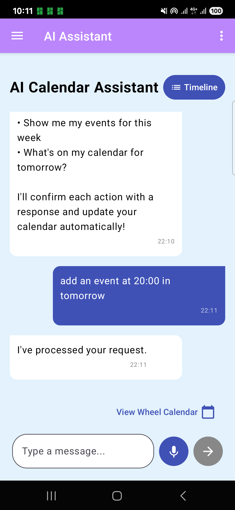
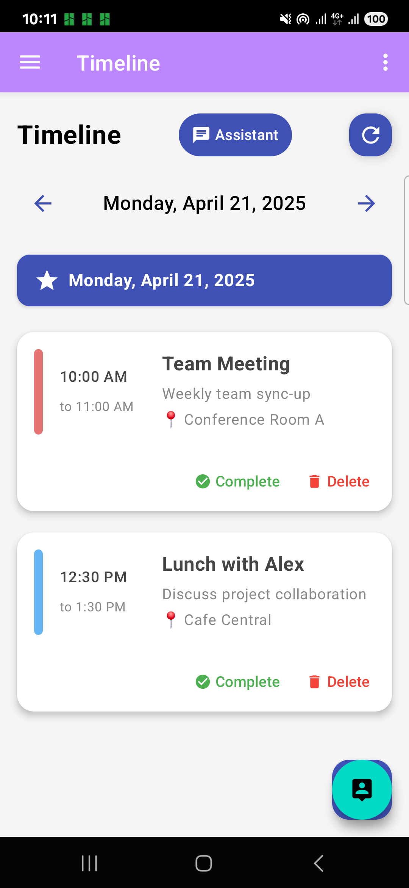

# 🗓️ CalendarPlan AI Assistant 🤖

> Your smart calendar companion that understands natural language! ✨

**Note:** This project is currently in a half-mockup working state and not fully functional. It demonstrates the UI and interaction flow but some features may not be fully implemented.

## 📱 Screenshots

<div align="center">
  
  
  
</div>

## ⚡ Features

- 🧠 AI-powered event creation and management
- 💬 Natural language understanding
- 🔄 Interactive timeline with day navigation
- 🎯 Event prioritization (High, Medium, Low)
- 🔊 Voice input support

## 🛠️ Tech Stack

- Kotlin + Jetpack Compose
- Material3 Design
- Gemini AI API
- MVVM Architecture

## 🚀 Quick Demo

Ask the assistant anything like:
```
"Schedule a team meeting tomorrow at 2pm for 1 hour"
"Remind me to call mom on Friday at 7pm"
"Set up a high priority dentist appointment next Monday at 10am"
```

## 🔄 Current Status

This is a prototype demonstrating the UI/UX of an AI-powered calendar assistant. Some functionality is simulated, and the app is not fully production-ready.

---

*Made with ☕ and AI magic*
